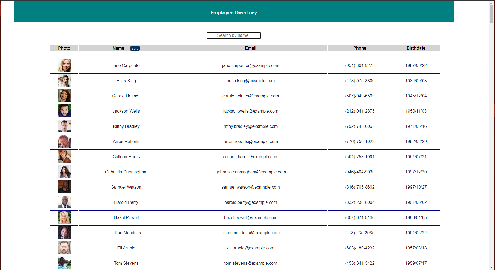

# React Employee Directory Example

### Table of Contents

  * [Description](#description)
  * [Installation](#installation)
  * [Screenshot](#screenshot)
  * [License](#license)
 
## Description 
 
 
This project was created to demonstrate the method that one would create a user directory of employees using react. By taking random user profiles from Random User API, we can demonstrate how an employer could use a similar tehnology for their own employees. The project features a sort and search/filter bar for finding and highlighting specific profiles.
      
## Installation
      
Simply head to the deployed URL: https://afternoon-beyond-85151.herokuapp.com/

## Screenshot

      
## License
      
MIT License

---
    
## Questions?
   
GitHub: [@MichaelMayor](https://api.github.com/users/MichaelMayor)